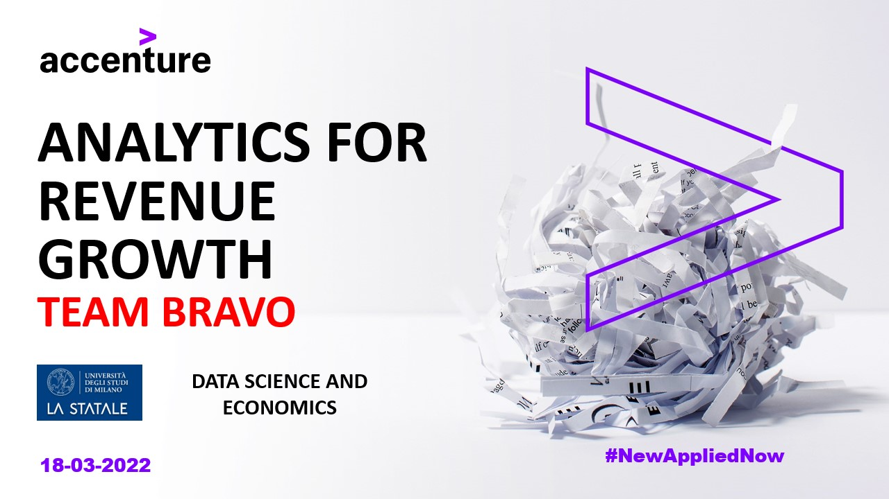
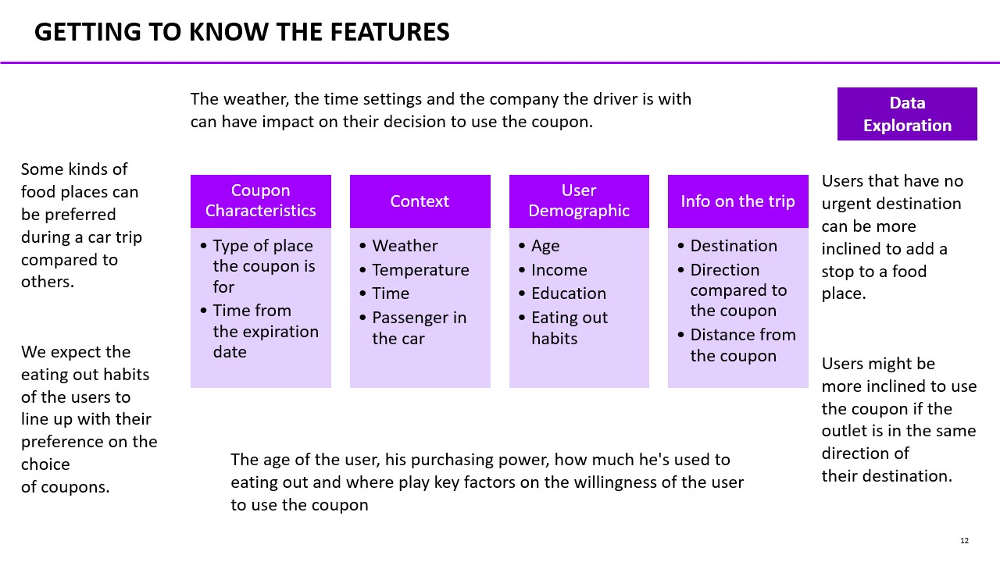
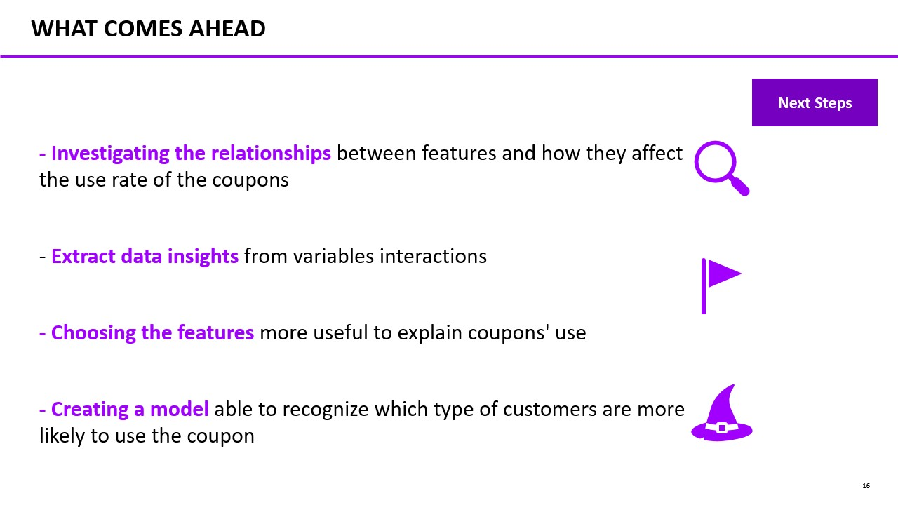
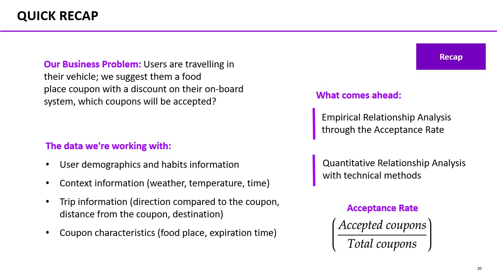
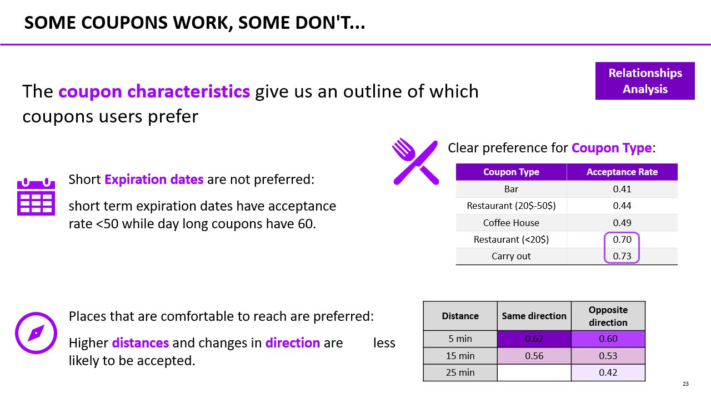
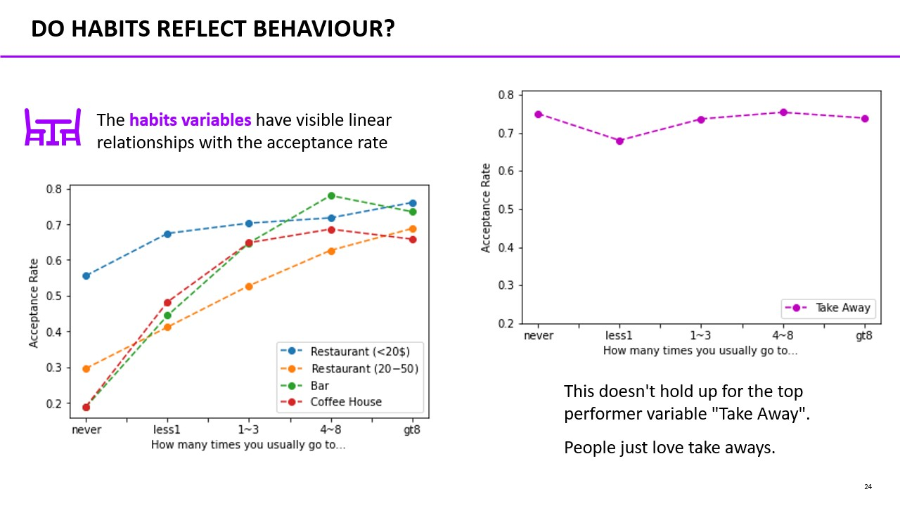

##  In-vehicle coupon recommendation analysis
This repository hosts an analysis on the [In-vehicle coupon recommendation Amazon dataset](https://www.kaggle.com/datasets/mathurinache/invehicle-coupon-recommendation) done for the laboratory held by Accenture.

The business problem is that of understanding which features have more weight on the acceptance rate of food discount coupons recommended to customers through their in-vehicle entertainment system while they're driving.

The laboratory team was composed by 3 members.

### Presentation preview
Following are some slides taken from the powerpoint presentation used to present the study keypoints.

